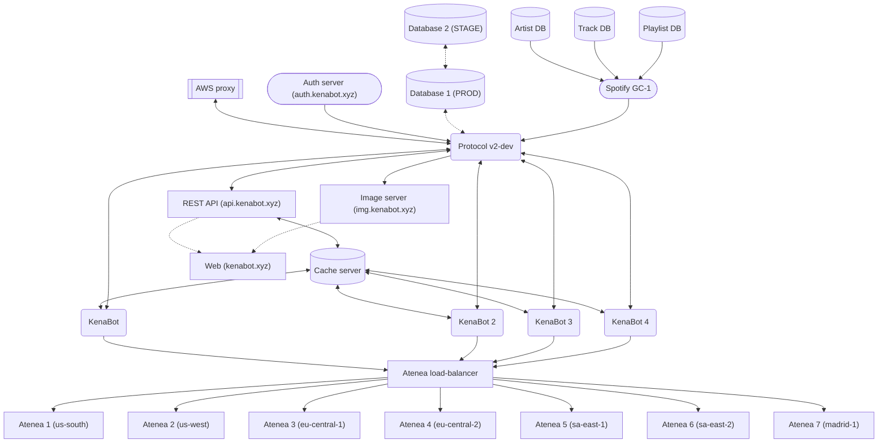

**[Página principal](https://www.kenabot.xyz) - [Invitar al bot](https://www.kenabot.xyz/#bots) - [Términos y condiciones de servicio](https://www.kenabot.xyz/tos) - [Política de privacidad](https://www.kenabot.xyz/privacy) - [Equipo](https://www.kenabot.xyz/team) - [Contacto](mailto:admin@kenabot.xyz)**

